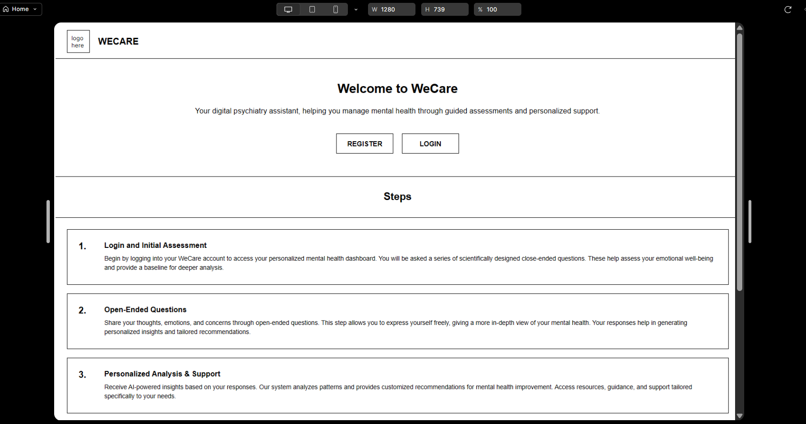
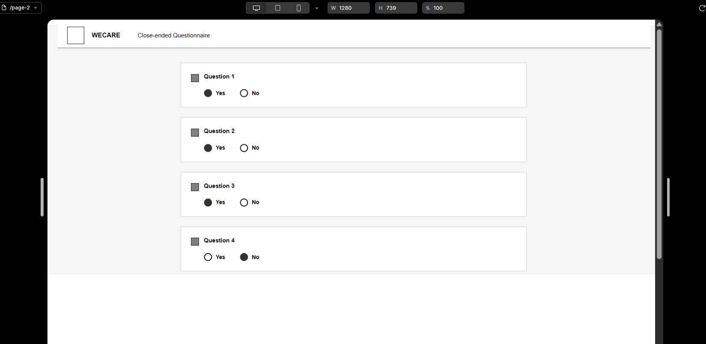
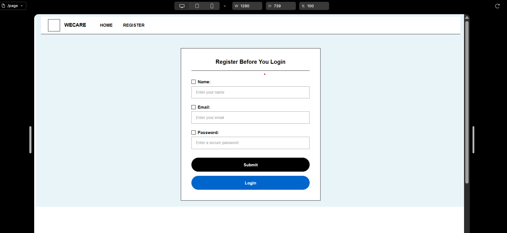
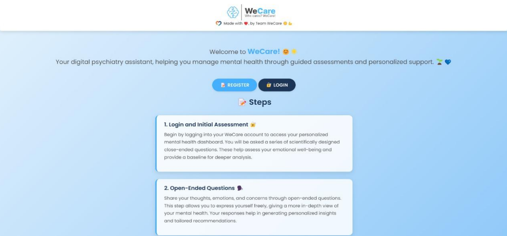
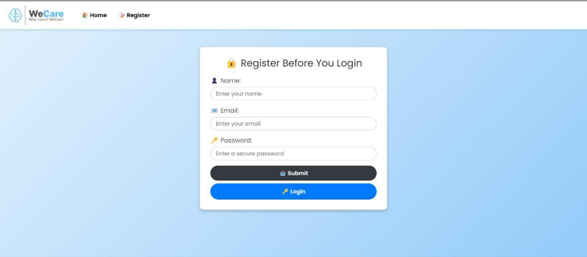
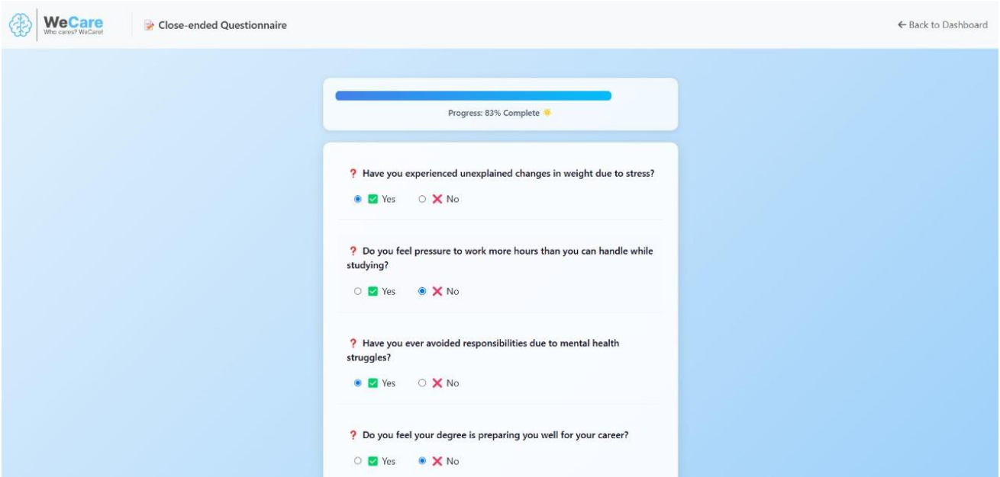
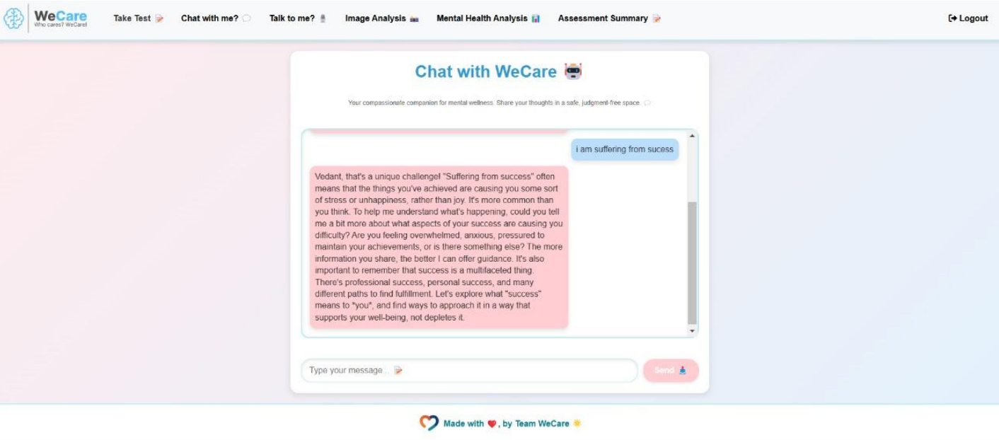
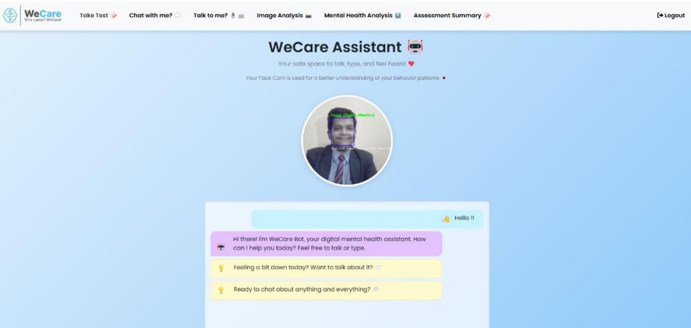
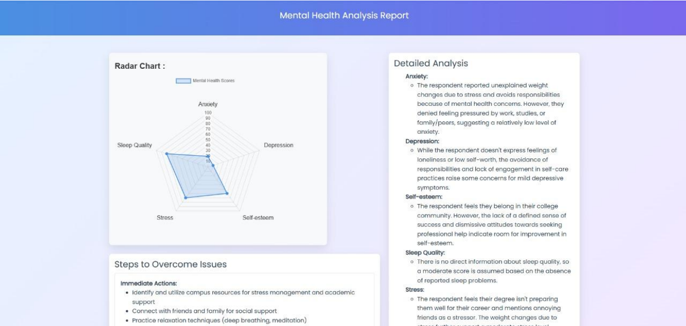

# WeCare-Student-Mental-Health-Analyser

WeCare is an AI-powered mental health support system designed to assist students in assessing and improving their emotional well-being. This interactive web-based application integrates multiple technologies, including facial emotion recognition, natural language processing, and a structured questionnaire system to provide a comprehensive mental health analysis.

🔍 Key Features:
🤖 AI Chatbot Interaction
Built using the Gemini API, the chatbot provides intelligent and empathetic responses to user queries related to stress, anxiety, depression, motivation, and more.

📷 Facial Emotion Recognition
Utilizes OpenCV for real-time webcam capture and CNN (Convolutional Neural Network) models to detect facial expressions such as happiness, sadness, anger, and fear, enhancing emotional context during conversations.

📝 Questionnaire-Based Assessment
Presents students with a series of mental health-related questions. Based on their responses, the system generates a personalized mental health report with suggestions and expert guidance.

📊 Emotion-Driven Prompting
Facial emotions captured during chat sessions are automatically passed as context to the chatbot, enabling emotion-aware conversations.

🌐 Flask Web Framework
The backend is developed using Flask, which handles routing, processes user data, and serves chat responses and reports in real-time.

🧠 Machine Learning Integration
Emotion detection is powered by a pre-trained CNN model, integrated seamlessly into the system for real-time inference.

📦 Data Preprocessing & UI
Clean and user-friendly front-end with webcam integration, live response rendering, and result visualization.

Wireframe Screenshots:

Output Screenshots:

